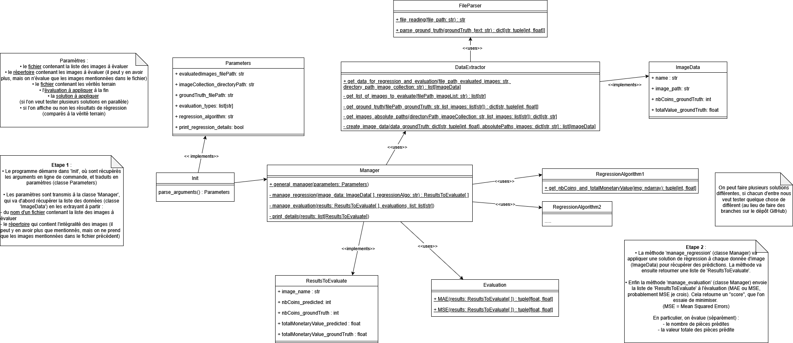

# Python libraries needed

- '***numpy***' and '***opencv-python***' for the structures and algorithms
- '***pandas***' and ***openpyxl*** for reading the Excel file (containing the ground truth)

# How to use the program

Use the command line to execute the program :  
`python project.py`  
There are also some options you can add to the command line.

The program needs :
- a file containing the list of images' names to apply the regression algorithm and evaluate
- a file containing the ground truth for the images to evaluate
- a directory containing all the images to evaluate

These files and directory are automatically taken from the directory '*data/*' at the root of the project, but you can also give other files and directory with the command line :
- `-f {file_imagesToEvaluate}` to give a file containing the list of images' names to evaluate
- `-g {file_groundTruth}` to give a file containing the ground truth
- `-d {directory_images}` to give a directory containing the images

There are also additional arguments :
- `-e [{evaluation_types} ...]` to choose the evaluations to apply (several evaluations possible ; by default : MSE) (chose between MAE and MSE for now)
- `-r {regression_algorithm}` to choose the regression algorithm to use (default : 1) (you can implement another algorithm and easily test it with this command)
- `-p` to print details : for each file, the regression prediction compared to the ground truth, for the number of coins and the total monetary value

# Program structure

The file '*project.py*' gets the arguments from the command line, and send them to the class Manager.  
The directory '*src/*' contains all the code.  
The directory '*data/*' is only for automatic usage of the program (not having to specify the necessary files and directory on the command line).  

  

