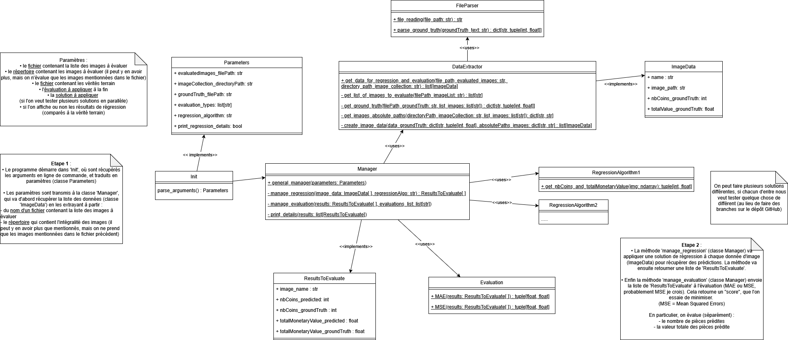

# Python libraries needed

- '***numpy***' and '***opencv-python***' for the structures and algorithms
- '***pandas***' and '***openpyxl***' for reading the Excel file (containing the ground truth)
- '***scikit-image***'

# Results

We evaluated the algorithm with notably MAE and MSE criteria. We also wanted to see how many cases had perfect predictions (or close enough).
We evaluated the number of coins and the monetary value, because they are available as ground truth.

For the **evaluation dataset** :

- *Number of coins*

| Perfect prediction | Difference of 1 or 2 | Difference > 2 |
|--------------------|----------------------|----------------|
|       64.38%       |        15.07%        |     20.55%     |

|     | Global | Only not perfect predictions |
|-----|--------|------------------------------|
| MAE | 2.67   |            7.50              |
| MSE | 61.22  |            171.88            |

- *Monetary value*

| Perfect value | Perfect value knowing perfect number of coins |
|---------------|-----------------------------------------------|
| 6.85%         |                 10.64%                        |

|     | Global | Only perfect number of coins predictions |
|-----|--------|------------------------------------------|
| MAE | 3.16   |               2.48                       |
| MSE | 26.61  |              15.75                       |

For the **test dataset** :

- *Number of coins*

| Perfect prediction | Difference of 1 or 2 | Difference > 2 |
|--------------------|----------------------|----------------|
|       56.25%       |        18.75%        |     25.00%     |

|     | Global | Only not perfect predictions |
|-----|--------|------------------------------|
| MAE | 3.06   |            7.00              |
| MSE | 63.19  |            144.43            |

- *Monetary value*

| Perfect value | Perfect value knowing perfect number of coins |
|---------------|-----------------------------------------------|
| 15.62%        |                 27.78%                        |

|     | Global | Only perfect number of coins predictions |
|-----|--------|------------------------------------------|
| MAE | 2.69   |               1.89                       |
| MSE | 17.66  |              12.39                       |

# How to use the program

Use the command line to execute the program :  
`python project.py`  
There are also some options you can add to the command line.

The program needs :
- a file containing the list of images' names to apply the regression algorithm and evaluate
- a file containing the ground truth for the images to evaluate
- a directory containing all the images to evaluate

These files and directory are automatically taken from the directory '*data/*' at the root of the project, but you can also give other files and directory with the command line :
- `-f {file_imagesToEvaluate}` to give a file containing the list of images' names to evaluate
- `-g {file_groundTruth}` to give a file containing the ground truth
- `-d {directory_images}` to give a directory containing the images

There are also additional arguments :
- `-e [{evaluation_types} ...]` to choose the evaluations to apply (several evaluations possible ; by default : MSE) (chose between MAE and MSE for now)
- `-r {regression_algorithm}` to choose the regression algorithm to use (default : 1) (you can implement another algorithm and easily test it with this command)
- `-p` to print details : for each file, the regression prediction compared to the ground truth, for the number of coins and the total monetary value

# Program structure

The file '*project.py*' gets the arguments from the command line, and send them to the class Manager.  
The directory '*src/*' contains all the code.  
The directory '*data/*' is only for automatic usage of the program (not having to specify the necessary files and directory on the command line).  

  

